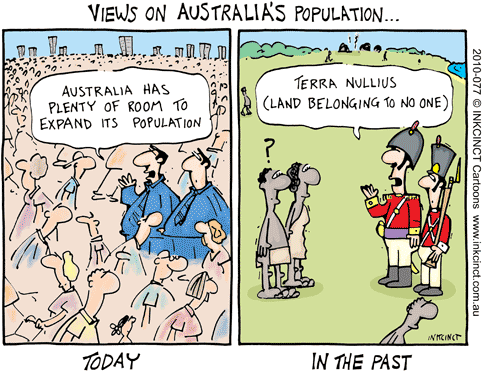

# Projecting the Australian population into the future, and estimating changes in associated carbon emissions

R code accompanying paper:

<a href="http://scholar.google.com.au/citations?sortby=pubdate&hl=en&user=1sO0O3wAAAAJ&view_op=list_works">Bradshaw, CJA</a>, BW Brook. 2016.  Implications of Australia’s population policy for future greenhouse-gas emissions targets. <em><strong>Asia and the Pacific Policy Studies</strong></em> 3: 249-265. doi:<a href="http://doi.org/10.1002/app5.135">10.1002/app5.135</a>

## Abstract
Australia’s high per capita emissions rates makes it is a major emitter of anthropogenic greenhouse gases, but its low intrinsic growth rate means that future increases in population size will be dictated by net overseas immigration. We constructed matrix models and projected the population to 2100 under six different
immigration scenarios. A constant 1 per cent proportional immigration scenario would result in 53 million people by 2100, producing 30.7 Gt CO2-e over that interval. Zero net immigration would achieve approximate population stability by mid-century and produce 24.1 Gt CO2-e. Achieving a 27 per cent reduction in annual emissions by 2030 would require a 1.5-to 2.0-fold reduction in per-capita emissions; an 80 per cent reduction by 2050 would require a 5.8- to 10.2-fold reduction. Australia’s capacity to limit its future emissions will therefore depend primarily on a massive technological transformation of its energy sector, but business-as-usual immigration rates will make achieving meaningful mid-century targets more difficult.

See also related <a href="https://conservationbytes.com/2016/06/12/what-immigration-means-for-australias-climate-change-policies/">blog post</a>.

 
Prof <a href="http://scholar.google.com.au/citations?sortby=pubdate&hl=en&user=1sO0O3wAAAAJ&view_op=list_works">Corey J. A. Bradshaw</a>  
<a href="http://globalecologyflinders.com" target="_blank">Global Ecology</a>, <a href="http://flinders.edu.au" target="_blank">Flinders University</a>, Adelaide, Australia  
January 2016  
<a href=mailto:corey.bradshaw@flinders.edu.au>e-mail</a>  

## R script
- <code>AusHumanProjection.R</code>

## Requires the following data files (in the <a href="https://github.com/cjabradshaw/AusHumanProjection/tree/main/data"><em>data</em></a> directory)
- mort.csv
- fert.csv
- totpop.csv
- mpop.csv
- fpop.csv
- n14.csv
- netMig.csv
- Mig.age.avg.exp.csv
- GDP.GPI.csv
- forest.csv

## Requires the following libraries
- <code>boot</code>

## Requires the following source-code file
- <code>matrixOperators.R</code> (in the <a href="https://github.com/cjabradshaw/DensityFeedbackSims/tree/main/source"><em>source</em></a> folder)
